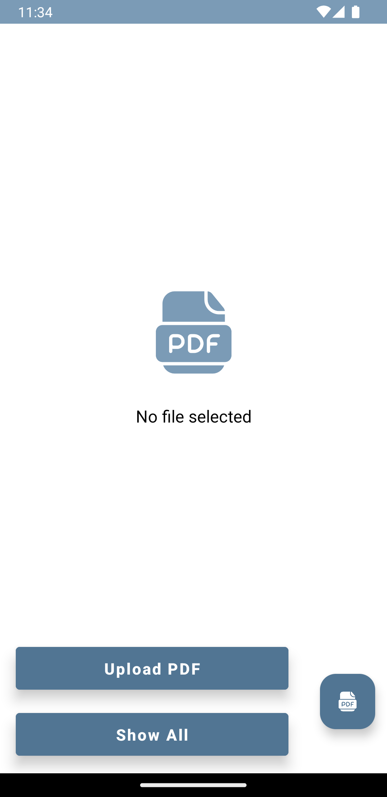
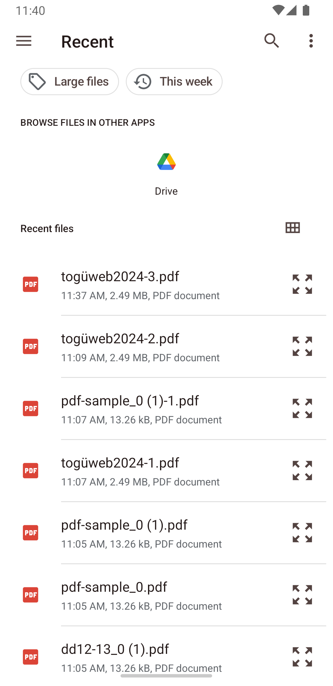
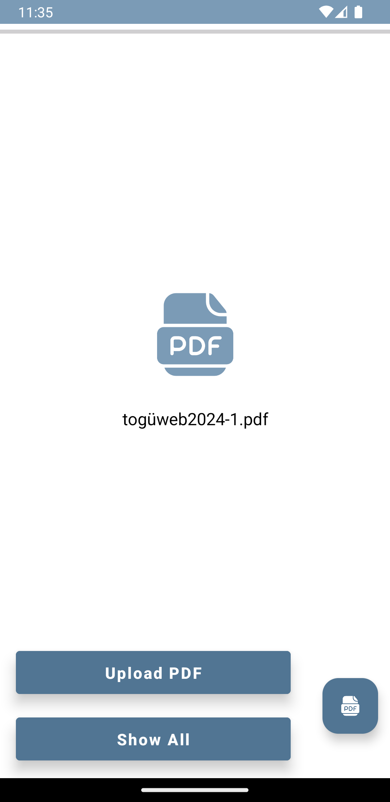
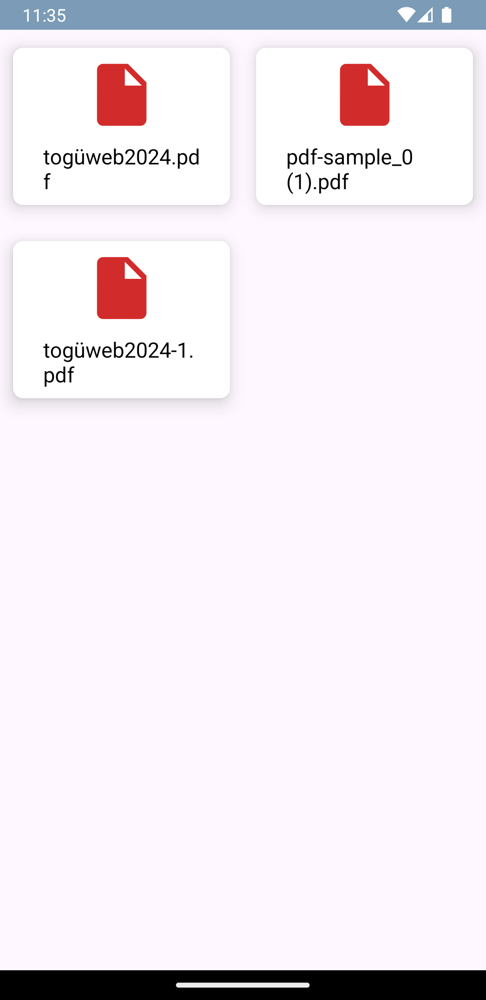
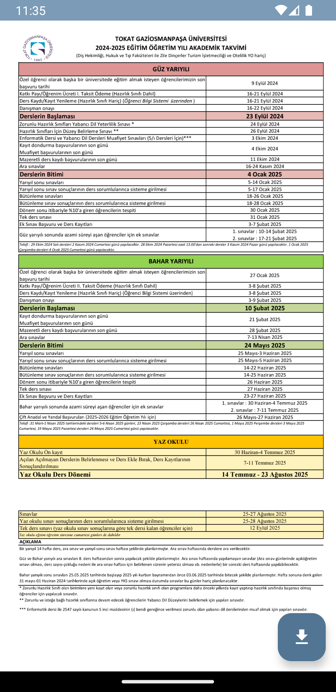
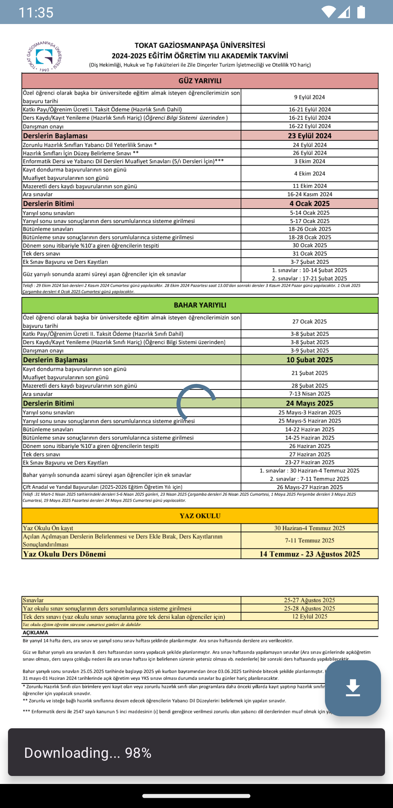

# FirebasePDF

+ Kotlin öğrenirken yaptığım bir başka uygulamamı paylaşmak istedim. FirebasePDF ile PDF dosyalarınızı Firebase veritabanına yükleyip istediğiniz zaman tekrar indirebilirsiniz.

## Temel Özellikler:

+ Yerelde bulunan bir PDF dosyası veritabanına yüklenebilir.
+ Yüklenilen PDF dosyaları GridView şeklinde listelenip görüntülenebilir.
+ Bulutta olan PDF dosyaları çevrimiçi görüntülenip yerele indirilebilir.

## Kurulum:

    git clone https://github.com/cusufcan/firebase_pdf

## Ekran Görüntüleri:

<table>
    <tr>
        <td></td>
        <td></td>
        <td></td>
    </tr>
    <tr>
        <td></td>
        <td></td>
        <td></td>
    </tr>
</table>

## Kullanılan Teknolojiler:

+ Kotlin
+ Kotlin Lifecycle
+ ViewBinding
+ DownloadManager
+ Firebase Realtime Database
+ Firebase Storage
+ PDF Viewer

## Lisans:

    MIT

